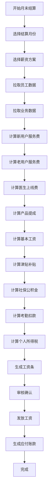

# 人力结算升级设计方案

## 一、升级背景

当前人力结算模块功能相对简单，而教练和医生的薪资结算实际情况较为复杂，需要升级为更完善的工资条系统，并将人力结算融入到应付账款模块中。

## 二、设计目标

1. **保留现有功能**：完全保留当前人力结算的所有功能
2. **融合应付账款**：将人力结算作为应付账款的重要组成部分
3. **工资条系统**：参考成熟工资条产品，实现完整的薪资管理
4. **灵活配置**：支持多种薪资结构和计算方式

## 三、核心功能设计

### 3.1 工资条系统架构

#### 3.1.1 薪资组成结构

```
工资条总览
├── 基本工资
│   ├── 岗位工资
│   ├── 绩效工资
│   └── 工龄工资
├── 业务提成
│   ├── 新用户服务费（¥400/人/月）
│   ├── 老用户服务费（¥100/人/月）
│   ├── 医生上线服务费（¥200/次）
│   └── 产品销售提成
├── 津贴补贴
│   ├── 交通补贴
│   ├── 通讯补贴
│   ├── 餐补
│   └── 住房补贴
├── 奖金
│   ├── 月度奖金
│   ├── 季度奖金
│   ├── 年终奖金
│   └── 特殊贡献奖
├── 社保公积金
│   ├── 养老保险（个人）
│   ├── 医疗保险（个人）
│   ├── 失业保险（个人）
│   ├── 住房公积金（个人）
│   └── 小计（个人部分）
├── 考勤扣款
│   ├── 迟到扣款
│   ├── 早退扣款
│   ├── 事假扣款
│   └── 病假扣款
├── 个人所得税
├── 实发工资
└── 备注
```

### 3.2 薪资方案配置

#### 3.2.0 富贵饼管理系统

**富贵饼发放界面：**

```typescript
interface RichBiscuit {
  id: string
  employeeId: string        // 员工ID
  employeeName: string      // 员工姓名
  amount: number            // 富贵饼数量（支持小数，如0.5、1.5等）
  value: number             // 价值（amount × 100元）
  reason: string            // 发放原因
  category: 'performance' | 'innovation' | 'teamwork' | 'extra' | 'other'
  issuerId: string          // 发放人ID（管理员）
  issuerName: string        // 发放人姓名
  issuedAt: Date            // 发放时间
  month: string             // 所属月份 YYYY-MM
  note?: string             // 备注
}

// 富贵饼发放统计
interface RichBiscuitStats {
  totalIssued: number       // 总发放饼数
  totalValue: number        // 总价值
  employeeRankings: Array<{
    employeeId: string
    employeeName: string
    amount: number
    rank: number
  }>
  categoryDistribution: Record<string, number>
}
```

**富贵饼发放页面：**
```
┌─────────────────────────────────────────────┐
│              富贵饼管理中心                  │
├─────────────────────────────────────────────┤
│ 本月统计                                   │
│  📊 总发放：123.5饼  价值：¥12,350        │
│  🥇 第1名：张三教练 (25饼)                 │
│  🥈 第2名：李四教练 (18饼)                 │
│  🥉 第3名：王五教练 (15饼)                 │
├─────────────────────────────────────────────┤
│ 发放富贵饼                                 │
│  选择教练：[下拉选择]                      │
│  发放数量：[  1.5  ]饼                    │
│  发放原因：[服务创新表扬  ]                │
│  分类：    [☑]绩效 [☑]创新 [ ]协作       │
│           [ ]额外贡献 [ ]其他             │
│  备注：    [___________________]           │
│                                           │
│           [立即发放] [批量发放]           │
├─────────────────────────────────────────────┤
│ 发放记录                                   │
│  时间        教练    数量   原因    发放人 │
│  02-25 14:30 张三    2.0   绩效优秀 管理员│
│  02-25 11:20 李四    0.5   团队协助 管理员│
│  02-24 16:45 王五    1.0   创新方案 管理员│
├─────────────────────────────────────────────┤
│ 历史统计                                   │
│  [  2025年2月  ▼]  [导出记录]             │
└─────────────────────────────────────────────┘
```

**富贵饼发放规则：**
1. 每个富贵饼价值固定为100元
2. 支持小数发放，最低0.1饼（10元）
3. 仅管理员有发放权限
4. 每次发放必须填写原因
5. 自动记录到当月工资条
6. 支持批量发放
7. 发放后不可撤销，可后续补发调整

**富贵饼分类说明：**
- `performance`（绩效）：工作表现优秀
- `innovation`（创新）：提出创新方案
- `teamwork`（协作）：团队协作优秀
- `extra`（额外）：额外贡献
- `other`（其他）：其他原因

#### 3.2.1 教练薪资方案

**方案A：底薪+提成制**
- 基本工资：3000元
- 新用户服务费：400元/人/月（服务满3个月内）
- 老用户服务费：100元/人/月（服务满3个月后）
- 上线服务激励：200元/次（医生上线时参与的教练）
- 富贵饼奖励：100元/饼（由管理员发放，支持小数）
- 产品销售提成：销售额的5%

**方案B：纯提成制**
- 无底薪
- 新用户服务费：450元/人/月
- 老用户服务费：120元/人/月
- 上线服务激励：250元/次
- 富贵饼奖励：100元/饼
- 产品销售提成：销售额的8%

**方案C：综合制**
- 基本工资：5000元
- 新用户服务费：300元/人/月
- 老用户服务费：80元/人/月
- 上线服务激励：150元/次
- 富贵饼奖励：100元/饼
- 月度奖金：根据绩效考核发放
- 年终奖：1-3个月工资

**富贵饼机制说明：**
- 定义：富贵饼是一种激励奖励单位，每个饼价值100元
- 发放权限：仅管理员可以发放
- 发放精度：支持小数，可发放0.1饼、0.5饼、1.5饼等
- 发放记录：所有发放都有完整记录，包括时间、原因、发放人
- 结算方式：月末汇总富贵饼数量，按100元/饼计入工资

#### 3.2.2 医生薪资方案

**方案A：基础薪资+上线次数制**
- 基本工资：5000元
- 上线服务费：200元/次
- 月度保底：5000元（未达到保底按保底发放）
- 季度奖金：根据服务质量和数量评定

**方案B：固定+提成**
- 基本工资：8000元
- 上线服务费：200元/次
- 新用户首次方案：100元/次
- 老用户复诊：50元/次
- 年终奖：2-4个月工资

**医生上线激励机制：**
- 每次上线服务：基础200元
- 夜间上线（22:00-06:00）：额外+50元
- 周末及节假日：额外+50元
- 紧急上线：额外+100元

#### 3.2.3 顾问薪资方案

**方案A：业绩提成**
- 无底薪
- 新用户签约：提成500元/人
- 老用户续约：提成200元/人
- 产品销售：销售额的10%

#### 3.2.4 通用佣金激励机制

**适用范围：所有角色（教练、医生、顾问、运营等）**

**佣金类型：**

1. **新用户签约佣金**
   - 促成新用户签约：根据岗位获得不同佣金
   - 教练：300元/人
   - 医生：200元/人
   - 顾问：500元/人
   - 运营：200元/人

2. **用户续约佣金**
   - 用户成功续约：获得续约佣金
   - 教练：80元/人
   - 医生：50元/人
   - 顾问：200元/人

3. **产品销售佣金**
   - 根据销售金额获得提成
   - 教练：销售额的5%
   - 医生：销售额的3%
   - 顾问：销售额的10%
   - 运营：销售额的5%

4. **推荐奖励佣金**
   - 推荐新员工入职：500元/人
   - 推荐新用户：100元/人

5. **业绩达标奖金**
   - 月度销售冠军：1000元
   - 季度优秀员工：2000元
   - 年度卓越贡献：5000元

**佣金结算规则：**
- 佣金独立于基本工资计算
- 按月统计，按月发放
- 可与富贵饼同时获得
- 发放记录可追溯
- 支持预提和借贷

#### 3.2.5 佣金管理系统设计

**佣金数据结构：**

```typescript
interface Commission {
  id: string
  employeeId: string        // 员工ID
  employeeName: string      // 员工姓名
  employeeRole: 'coach' | 'doctor' | 'consultant' | 'operations' | 'admin'
  type: 'new_user' | 'renewal' | 'product_sale' | 'referral' | 'bonus'
  category: string          // 佣金类别

  // 关联信息
  relatedUserId?: string    // 关联用户ID
  relatedUserName?: string  // 关联用户姓名
  relatedProductId?: string // 关联产品ID
  relatedProductName?: string

  // 金额
  amount: number            // 佣金金额
  rate?: number            // 提成比例（如0.05表示5%）
  baseAmount?: number      // 计算基数（如销售额）

  // 状态
  status: 'pending' | 'approved' | 'paid' | 'cancelled'

  // 时间
  occurredAt: Date         // 佣金产生时间
  month: string            // 所属月份 YYYY-MM

  // 审批
  approvedBy?: string
  approvedAt?: Date
  paidBy?: string
  paidAt?: Date

  // 备注
  note?: string
}
```

**佣金管理界面功能：**
1. **佣金统计仪表板** - 按类型、角色统计
2. **佣金发放管理** - 审批、批量发放
3. **我的佣金查询** - 员工查看自己的佣金
4. **佣金报表导出** - 月度、季度、年度报表

### 3.3 界面设计

#### 3.3.1 工资条管理页面

**功能模块：**

1. **工资条概览**
   - 显示本月工资汇总
   - 实发工资统计
   - 应发工资统计
   - 待发放金额

2. **工资条列表**
   - 按月份查看历史工资条
   - 按员工筛选
   - 支持导出PDF/Excel
   - 支持批量发放

3. **工资条详情**
   ```
   ┌─────────────────────────────────────┐
   │         惯能健康 CRM 工资条          │
   │         2025年2月                    │
   ├─────────────────────────────────────┤
   │ 员工信息                            │
   │  姓名：张三        工号：C001       │
   │  部门：健康教练      职位：高级教练  │
   ├─────────────────────────────────────┤
   │ 收入明细                            │
   │  基本工资：        ¥5,000.00        │
   │  岗位工资：        ¥2,000.00        │
   │  绩效工资：        ¥1,500.00        │
   │  ─────────────────────────────────  │
   │  新用户服务费(12人)： ¥4,800.00    │
   │  老用户服务费(35人)： ¥3,500.00    │
   │  上线服务激励(8次)：  ¥1,600.00    │
   │  富贵饼奖励(2.5饼)：  ¥250.00      │
   │  产品销售提成：      ¥850.00        │
   │  ─────────────────────────────────  │
   │  交通补贴：          ¥500.00        │
   │  通讯补贴：          ¥200.00        │
   │  餐补：              ¥300.00        │
   ├─────────────────────────────────────┤
   │ 扣款明细                            │
   │  养老保险(8%)：     ¥560.00        │
   │  医疗保险(2%)：     ¥140.00        │
   │  失业保险(0.5%)：   ¥35.00         │
   │  住房公积金(12%)：  ¥840.00        │
   │  迟到扣款(2次)：     ¥40.00        │
   │  个人所得税：        ¥685.50       │
   ├─────────────────────────────────────┤
   │ 汇总                                │
   │  应发工资：          ¥18,650.00     │
   │  扣款合计：          ¥2,300.50     │
   │  ─────────────────────────────────  │
   │  实发工资：          ¥16,349.50     │
   ├─────────────────────────────────────┤
   │ 备注                                │
   │  本月绩效考核：优秀                  │
   │  年终奖进度：6/12                   │
   └─────────────────────────────────────┘
   ```

#### 3.3.2 薪资方案配置页面

**功能：**
- 新增薪资方案
- 编辑薪资方案
- 方案模板管理
- 方案分配给员工

**配置项：**
```typescript
interface SalaryScheme {
  id: string
  name: string
  type: 'coach' | 'doctor' | 'consultant'
  baseSalary?: number
  commissionRules: {
    newUserRate: number      // 新用户费率
    oldUserRate: number       // 老用户费率
    doctorOnlineRate: number  // 医生上线费率
    productCommission: number // 产品提成比例
  }
  allowances: {
    traffic?: number
    communication?: number
    meal?: number
    housing?: number
  }
  socialInsurance: {
    pension: number      // 养老保险比例
    medical: number      // 医疗保险比例
    unemployment: number // 失业保险比例
    housingFund: number  // 公积金比例
  }
  performanceBonus?: {
    enabled: boolean
    levels: Array<{
      name: string
      minScore: number
      maxScore: number
      bonus: number
    }>
  }
  yearEndBonus?: {
    enabled: boolean
    months: number  // 年终奖月数范围
  }
}
```

### 3.4 应付账款融合

#### 3.4.1 数据流向

```
人力结算模块
    ↓ 生成工资条
    ↓ 标记为待发放
应付账款模块
    ↓ 自动生成应付单据
    ↓ 应付类型：工资薪金
    ↓ 金额：实发工资总额
    ↓ 关联：工资条ID、员工ID、月份
财务支付
    ↓ 批量支付
    ↓ 标记为已支付
    ↓ 更新应付账款状态
```

#### 3.4.2 应付账款新增字段

```typescript
interface AccountPayable {
  // ... 现有字段
  type: 'salary' | 'purchase' | 'service' | 'other'  // 应付类型
  salary?: {
    salarySlipId: string      // 工资条ID
    employeeId: string        // 员工ID
    employeeName: string      // 员工姓名
    month: string             // 工资月份 YYYY-MM
    grossSalary: number       // 应发工资
    netSalary: number         // 实发工资
    attachments: string[]     // 附件（工资条PDF等）
  }
}
```

### 3.5 核心功能流程

#### 3.5.1 工资条生成流程



#### 3.5.2 数据同步机制

**实时同步触发条件：**
1. 工资条审核通过后
2. 员工绑定关系变更
3. 用户服务状态变更
4. 产品销售数据更新

**同步内容：**
- 员工基本信息
- 用户服务关系
- 服务统计数据
- 考勤数据
- 业绩数据

### 3.6 权限设计

#### 3.6.1 角色权限矩阵

| 功能 | 管理员 | 财务 | 教练 | 医生 | 顾问 | 运营 |
|------|--------|------|------|------|------|------|
| 查看自己工资条 | ✓ | ✓ | ✓ | ✓ | ✓ | ✓ |
| 查看团队工资条 | ✓ | ✓ | ✗ | ✗ | ✗ | ✓ |
| 编辑薪资方案 | ✓ | ✓ | ✗ | ✗ | ✗ | ✗ |
| 生成工资条 | ✓ | ✓ | ✗ | ✗ | ✗ | ✗ |
| 审核工资条 | ✓ | ✓ | ✗ | ✗ | ✗ | ✗ |
| 发放工资 | ✗ | ✓ | ✗ | ✗ | ✗ | ✗ |
| 导出工资条 | ✓ | ✓ | 仅自己 | 仅自己 | 仅自己 | ✓ |

### 3.7 技术实现要点

#### 3.7.1 数据结构

```typescript
// 工资条
interface SalarySlip {
  id: string
  employeeId: string
  employeeName: string
  department: string
  position: string
  month: string              // YYYY-MM
  schemeId: string          // 薪资方案ID

  // 收入
  income: {
    baseSalary: number
    positionSalary: number
    performanceSalary: number
    senioritySalary: number
    commission: {
      newUserCount: number
      newUserAmount: number
      oldUserCount: number
      oldUserAmount: number
      onlineServices: {
        count: number              // 上线服务次数
        normalRate: number         // 普通上线费率
        nightRate: number          // 夜间上线费率
        weekendRate: number        // 周末节假日费率
        urgentRate: number         // 紧急上线费率
        totalAmount: number        // 总金额
      }
      richBiscuits: {
        amount: number             // 富贵饼数量
        value: number              // 价值（饼数 × 100）
        details: Array<{
          id: string
          amount: number
          reason: string
          category: string
          issuedAt: Date
        }>
      }
      productSales: number
      productCommission: number
    }
    allowances: {
      traffic: number
      communication: number
      meal: number
      housing: number
    }
    bonus: {
      monthly: number
      quarterly: number
      yearly: number
      special: number
    }
  }

  // 扣款
  deductions: {
    socialInsurance: {
      pension: number
      medical: number
      unemployment: number
      housingFund: number
    }
    attendance: {
      late: number
      earlyLeave: number
      personalLeave: number
      sickLeave: number
    }
    tax: number
  }

  // 汇总
  summary: {
    grossSalary: number      // 应发工资
    totalDeductions: number  // 扣款合计
    netSalary: number        // 实发工资
  }

  // 状态
  status: 'draft' | 'pending' | 'approved' | 'paid' | 'cancelled'

  // 备注
  notes: string
  attachments: string[]

  // 时间戳
  createdAt: Date
  approvedAt?: Date
  paidAt?: Date

  // 审批信息
  approvedBy?: string
  paidBy?: string
}
```

#### 3.7.2 核心计算函数

```typescript
// 计算服务费
function calculateServiceFee(
  employeeId: string,
  month: string,
  scheme: SalaryScheme
): ServiceFeeResult {
  // 获取员工绑定的用户列表
  const bindings = getUserBindings(employeeId)

  // 统计新用户（服务满3个月内）
  const newUsers = bindings.filter(b => {
    const serviceMonths = getServiceMonths(b.firstServiceDate, month)
    return serviceMonths <= 3
  })

  // 统计老用户（服务满3个月后）
  const oldUsers = bindings.filter(b => {
    const serviceMonths = getServiceMonths(b.firstServiceDate, month)
    return serviceMonths > 3
  })

  // 获取医生上线服务次数
  const doctorOnlineServices = getDoctorOnlineServices(employeeId, month)

  return {
    newUserCount: newUsers.length,
    newUserAmount: newUsers.length * scheme.commissionRules.newUserRate,
    oldUserCount: oldUsers.length,
    oldUserAmount: oldUsers.length * scheme.commissionRules.oldUserRate,
    doctorOnlineCount: doctorOnlineServices.length,
    doctorOnlineAmount: doctorOnlineServices.length * scheme.commissionRules.doctorOnlineRate
  }
}

// 计算社保公积金
function calculateSocialInsurance(
  grossSalary: number,
  rates: SocialInsuranceRates
): SocialInsuranceResult {
  return {
    pension: grossSalary * rates.pension,           // 养老保险8%
    medical: grossSalary * rates.medical,           // 医疗保险2%
    unemployment: grossSalary * rates.unemployment, // 失业保险0.5%
    housingFund: grossSalary * rates.housingFund,   // 公积金12%
    total: grossSalary * (rates.pension + rates.medical +
                          rates.unemployment + rates.housingFund)
  }
}

// 计算个人所得税（简化版）
function calculateIncomeTax(
  taxableIncome: number
): number {
  // 简化的个税计算（实际应使用累进税率）
  const brackets = [
    { limit: 3500, rate: 0.03 },
    { limit: 9000, rate: 0.10 },
    { limit: 25000, rate: 0.20 },
    { limit: 35000, rate: 0.25 },
    { limit: 55000, rate: 0.30 },
    { limit: 80000, rate: 0.35 },
    { limit: Infinity, rate: 0.45 }
  ]

  let tax = 0
  let remaining = taxableIncome

  for (const bracket of brackets) {
    if (remaining <= 0) break
    const taxable = Math.min(remaining, bracket.limit)
    tax += taxable * bracket.rate
    remaining -= taxable
  }

  return tax
}
```

## 四、实施步骤

### 阶段一：基础功能开发（2周）
1. 创建工资条数据模型和API
2. 开发薪资方案配置功能
3. 实现工资条生成逻辑
4. 开发工资条查看功能

### 阶段二：融合应付账款（1周）
1. 应付账款模块增加工资类型
2. 工资条自动生成应付单据
3. 支付流程打通

### 阶段三：高级功能（2周）
1. 考勤数据集成
2. 绩效奖金计算
3. 年终奖计算
4. 个税自动计算（对接税务系统）

### 阶段四：优化完善（1周）
1. 批量操作优化
2. 导出功能完善
3. 通知提醒功能
4. 数据统计分析

## 五、参考产品功能清单

### 5.1 必备功能
- ✅ 工资条生成与查看
- ✅ 多薪资方案配置
- ✅ 自动计算功能
- ✅ 社保公积金计算
- ✅ 个税计算
- ✅ 考勤扣款
- ✅ 工资条导出（PDF/Excel）
- ✅ 批量发放
- ✅ 历史记录查询

### 5.2 高级功能
- ✅ 绩效奖金自动计算
- ✅ 年终奖计算
- ✅ 工资预测
- ✅ 成本分析
- ✅ 对比报表
- ✅ 异常提醒
- ✅ 审批流程
- ✅ 银行对接（代发工资）

### 5.3 扩展功能（未来）
- 电子工资条（微信/邮件推送）
- 工资单加密
- 员工自助查询
- 移动端查看
- 数据分析大屏
- 薪酬预算管理

## 六、注意事项

1. **数据安全性**
   - 工资数据敏感，需要加密存储
   - 访问权限严格控制
   - 操作日志完整记录

2. **计算准确性**
   - 所有计算需要可追溯
   - 支持计算过程查看
   - 异常数据自动提醒

3. **合规性**
   - 符合劳动法规定
   - 社保公积金按法定比例
   - 个税计算符合税法

4. **灵活性**
   - 支持特殊场景处理
   - 支持手动调整
   - 支持补发工资

## 七、富贵饼管理实现

### 7.1 富贵饼发放组件

```vue
<!-- RichBiscuitManager.vue -->
<template>
  <div class="space-y-6">
    <!-- 本月统计卡片 -->
    <div class="grid grid-cols-1 md:grid-cols-4 gap-4">
      <div class="bg-gradient-to-br from-yellow-400 to-orange-500 rounded-xl p-5 text-white">
        <div class="flex items-center gap-2 mb-2">
          <Award :size="20}" />
          <span class="text-sm">本月总发放</span>
        </div>
        <div class="text-3xl font-bold">{{ monthlyStats.totalIssued }} 饼</div>
        <div class="text-sm opacity-90">价值 ¥{{ monthlyStats.totalValue.toLocaleString() }}</div>
      </div>

      <div class="bg-white rounded-xl p-5 border border-slate-200">
        <div class="text-sm text-slate-600 mb-1">🥇 第一名</div>
        <div class="font-semibold text-slate-900">{{ monthlyStats.top1?.name }}</div>
        <div class="text-lg font-bold text-orange-600">{{ monthlyStats.top1?.amount }} 饼</div>
      </div>

      <div class="bg-white rounded-xl p-5 border border-slate-200">
        <div class="text-sm text-slate-600 mb-1">🥈 第二名</div>
        <div class="font-semibold text-slate-900">{{ monthlyStats.top2?.name }}</div>
        <div class="text-lg font-bold text-orange-600">{{ monthlyStats.top2?.amount }} 饼</div>
      </div>

      <div class="bg-white rounded-xl p-5 border border-slate-200">
        <div class="text-sm text-slate-600 mb-1">🥉 第三名</div>
        <div class="font-semibold text-slate-900">{{ monthlyStats.top3?.name }}</div>
        <div class="text-lg font-bold text-orange-600">{{ monthlyStats.top3?.amount }} 饼</div>
      </div>
    </div>

    <!-- 发放表单 -->
    <div class="bg-white rounded-xl border border-slate-200 p-6">
      <h3 class="text-lg font-semibold text-slate-900 mb-4">发放富贵饼</h3>
      <form @submit.prevent="issueBiscuit" class="space-y-4">
        <div class="grid grid-cols-2 gap-4">
          <div>
            <label class="block text-sm font-medium text-slate-700 mb-2">选择教练 *</label>
            <select v-model="form.employeeId" required class="w-full px-3 py-2 border border-slate-300 rounded-lg">
              <option value="">请选择教练</option>
              <option v-for="coach in coaches" :key="coach.id" :value="coach.id">
                {{ coach.name }}
              </option>
            </select>
          </div>
          <div>
            <label class="block text-sm font-medium text-slate-700 mb-2">发放数量（饼）*</label>
            <input
              v-model.number="form.amount"
              type="number"
              step="0.1"
              min="0.1"
              max="100"
              required
              class="w-full px-3 py-2 border border-slate-300 rounded-lg"
              placeholder="支持小数，如 1.5"
            />
            <p class="text-xs text-slate-500 mt-1">
              价值：¥{{ (form.amount * 100).toFixed(2) }}（每个饼价值100元）
            </p>
          </div>
        </div>

        <div>
          <label class="block text-sm font-medium text-slate-700 mb-2">发放原因 *</label>
          <input
            v-model="form.reason"
            type="text"
            required
            class="w-full px-3 py-2 border border-slate-300 rounded-lg"
            placeholder="请填写发放原因，如：服务创新、绩效优秀等"
          />
        </div>

        <div>
          <label class="block text-sm font-medium text-slate-700 mb-2">分类 *</label>
          <div class="flex gap-4">
            <label class="flex items-center gap-2">
              <input type="radio" v-model="form.category" value="performance" />
              <span>🏆 绩效优秀</span>
            </label>
            <label class="flex items-center gap-2">
              <input type="radio" v-model="form.category" value="innovation" />
              <span>💡 创新方案</span>
            </label>
            <label class="flex items-center gap-2">
              <input type="radio" v-model="form.category" value="teamwork" />
              <span>🤝 团队协作</span>
            </label>
            <label class="flex items-center gap-2">
              <input type="radio" v-model="form.category" value="extra" />
              <span>⭐ 额外贡献</span>
            </label>
            <label class="flex items-center gap-2">
              <input type="radio" v-model="form.category" value="other" />
              <span>📝 其他</span>
            </label>
          </div>
        </div>

        <div>
          <label class="block text-sm font-medium text-slate-700 mb-2">备注</label>
          <textarea
            v-model="form.note"
            rows="2"
            class="w-full px-3 py-2 border border-slate-300 rounded-lg"
            placeholder="填写补充说明..."
          />
        </div>

        <div class="flex gap-3">
          <button
            type="submit"
            class="px-6 py-2 bg-orange-600 text-white rounded-lg hover:bg-orange-700 font-medium"
          >
            立即发放
          </button>
          <button
            type="button"
            @click="showBatchDialog = true"
            class="px-6 py-2 border border-slate-300 text-slate-700 rounded-lg hover:bg-slate-50 font-medium"
          >
            批量发放
          </button>
        </div>
      </form>
    </div>

    <!-- 发放记录列表 -->
    <div class="bg-white rounded-xl border border-slate-200 overflow-hidden">
      <div class="px-6 py-4 border-b border-slate-200 flex items-center justify-between">
        <h3 class="text-lg font-semibold text-slate-900">发放记录</h3>
        <select v-model="selectedMonth" class="px-3 py-2 border border-slate-300 rounded-lg text-sm">
          <option value="2025-02">2025年2月</option>
          <option value="2025-01">2025年1月</option>
        </select>
      </div>
      <table class="w-full">
        <thead class="bg-slate-50">
          <tr>
            <th class="px-4 py-3 text-left text-xs font-semibold text-slate-600">发放时间</th>
            <th class="px-4 py-3 text-left text-xs font-semibold text-slate-600">教练</th>
            <th class="px-4 py-3 text-left text-xs font-semibold text-slate-600">数量</th>
            <th class="px-4 py-3 text-left text-xs font-semibold text-slate-600">价值</th>
            <th class="px-4 py-3 text-left text-xs font-semibold text-slate-600">原因</th>
            <th class="px-4 py-3 text-left text-xs font-semibold text-slate-600">分类</th>
            <th class="px-4 py-3 text-left text-xs font-semibold text-slate-600">发放人</th>
          </tr>
        </thead>
        <tbody class="divide-y divide-slate-200">
          <tr v-for="record in filteredRecords" :key="record.id" class="hover:bg-slate-50">
            <td class="px-4 py-3 text-sm text-slate-600">{{ formatDate(record.issuedAt) }}</td>
            <td class="px-4 py-3 text-sm font-medium text-slate-900">{{ record.employeeName }}</td>
            <td class="px-4 py-3 text-sm font-semibold text-orange-600">{{ record.amount }} 饼</td>
            <td class="px-4 py-3 text-sm text-slate-900">¥{{ record.value.toFixed(2) }}</td>
            <td class="px-4 py-3 text-sm text-slate-600">{{ record.reason }}</td>
            <td class="px-4 py-3">
              <span class="px-2 py-1 text-xs rounded-full" :class="getCategoryClass(record.category)">
                {{ getCategoryLabel(record.category) }}
              </span>
            </td>
            <td class="px-4 py-3 text-sm text-slate-600">{{ record.issuerName }}</td>
          </tr>
        </tbody>
      </table>
    </div>
  </div>
</template>

<script setup lang="ts">
import { ref, computed, onMounted } from 'vue'
import { Award } from 'lucide-vue-next'
import { useToast } from '../composables/useToast'

const toast = useToast()

// 表单数据
const form = ref({
  employeeId: '',
  amount: 1,
  reason: '',
  category: 'performance' as const,
  note: ''
})

// 统计数据
const monthlyStats = ref({
  totalIssued: 0,
  totalValue: 0,
  top1: null,
  top2: null,
  top3: null
})

// 发放记录
const records = ref([])
const selectedMonth = ref('2025-02')

// 教练列表
const coaches = ref([])

// 筛选后的记录
const filteredRecords = computed(() => {
  return records.value.filter(r => r.month === selectedMonth.value)
})

// 发放富贵饼
const issueBiscuit = async () => {
  try {
    const value = form.value.amount * 100

    const newRecord = {
      id: Date.now().toString(),
      employeeId: form.value.employeeId,
      employeeName: coaches.value.find(c => c.id === form.value.employeeId)?.name,
      amount: form.value.amount,
      value,
      reason: form.value.reason,
      category: form.value.category,
      issuerId: 'admin',
      issuerName: '管理员',
      issuedAt: new Date(),
      month: new Date().toISOString().slice(0, 7)
    }

    records.value.unshift(newRecord)
    await updateStats()

    toast.success('发放成功', `已发放 ${form.value.amount} 饼（¥${value}）`)

    // 重置表单
    form.value = {
      employeeId: '',
      amount: 1,
      reason: '',
      category: 'performance',
      note: ''
    }
  } catch (error) {
    toast.error('发放失败', error.message)
  }
}

// 更新统计数据
const updateStats = async () => {
  const monthRecords = records.value.filter(r => r.month === selectedMonth.value)

  monthlyStats.value = {
    totalIssued: monthRecords.reduce((sum, r) => sum + r.amount, 0),
    totalValue: monthRecords.reduce((sum, r) => sum + r.value, 0),
    ...getRankings(monthRecords)
  }
}

// 获取排名
const getRankings = (monthRecords) => {
  const employeeTotals = {}
  monthRecords.forEach(r => {
    employeeTotals[r.employeeId] = (employeeTotals[r.employeeId] || 0) + r.amount
  })

  const sorted = Object.entries(employeeTotals)
    .sort((a, b) => b[1] - a[1])
    .slice(0, 3)

  return {
    top1: sorted[0] ? { id: sorted[0][0], name: sorted[0][0], amount: sorted[0][1] } : null,
    top2: sorted[1] ? { id: sorted[1][0], name: sorted[1][0], amount: sorted[1][1] } : null,
    top3: sorted[2] ? { id: sorted[2][0], name: sorted[2][0], amount: sorted[2][1] } : null
  }
}

// 获取分类样式
const getCategoryClass = (category: string) => {
  const classes = {
    performance: 'bg-yellow-100 text-yellow-800',
    innovation: 'bg-purple-100 text-purple-800',
    teamwork: 'bg-blue-100 text-blue-800',
    extra: 'bg-green-100 text-green-800',
    other: 'bg-slate-100 text-slate-800'
  }
  return classes[category] || classes.other
}

// 获取分类标签
const getCategoryLabel = (category: string) => {
  const labels = {
    performance: '🏆 绩效',
    innovation: '💡 创新',
    teamwork: '🤝 协作',
    extra: '⭐ 额外',
    other: '📝 其他'
  }
  return labels[category] || '其他'
}

// 格式化日期
const formatDate = (date: Date) => {
  const d = new Date(date)
  return `${d.getMonth() + 1}-${d.getDate()} ${d.getHours()}:${d.getMinutes().toString().padStart(2, '0')}`
}

onMounted(() => {
  updateStats()
})
</script>
```

### 7.2 上线服务统计

```typescript
// 上线服务统计
interface OnlineServiceStats {
  employeeId: string
  month: string

  // 按类型统计
  services: {
    normal: number      // 普通上线次数
    night: number       // 夜间上线次数
    weekend: number     // 周末上线次数
    urgent: number      // 紧急上线次数
    total: number       // 总次数
  }

  // 金额计算
  amounts: {
    normal: number      // 普通上线金额
    night: number       // 夜间上线金额
    weekend: number     // 周末上线金额
    urgent: number      // 紧急上线金额
    total: number       // 总金额
  }

  // 服务明细
  details: Array<{
    id: string
    date: Date
    type: 'normal' | 'night' | 'weekend' | 'urgent'
    userId: string
    userName: string
    duration: number    // 服务时长（分钟）
    amount: number
  }>
}

// 计算上线服务激励
function calculateOnlineServiceIncentive(
  employeeId: string,
  month: string
): OnlineServiceStats {
  const services = getOnlineServices(employeeId, month)

  const stats = {
    normal: 0,
    night: 0,
    weekend: 0,
    urgent: 0,
    total: services.length
  }

  let totalAmount = 0

  services.forEach(service => {
    const type = getServiceType(service)
    const rate = getRateByType(type)

    stats[type]++
    totalAmount += rate
  })

  return {
    employeeId,
    month,
    services: stats,
    amounts: {
      normal: stats.normal * 200,
      night: stats.night * 250,      // 普通费率 + 50
      weekend: stats.weekend * 250,   // 普通费率 + 50
      urgent: stats.urgent * 300,     // 普通费率 + 100
      total: totalAmount
    },
    details: services
  }
}

// 判断服务类型
function getServiceType(service: any): 'normal' | 'night' | 'weekend' | 'urgent' {
  const hour = new Date(service.date).getHours()
  const day = new Date(service.date).getDay()

  if (service.isUrgent) return 'urgent'
  if (hour >= 22 || hour < 6) return 'night'
  if (day === 0 || day === 6) return 'weekend'
  return 'normal'
}

// 按类型获取费率
function getRateByType(type: string): number {
  const rates = {
    normal: 200,
    night: 250,
    weekend: 250,
    urgent: 300
  }
  return rates[type] || 200
}
```

### 7.3 富贵饼在工资条中的显示

```vue
<!-- 工资条中的富贵饼部分 -->
<div class="bg-orange-50 border border-orange-200 rounded-lg p-4">
  <div class="flex items-center gap-2 mb-3">
    <Award :size="18}" class="text-orange-600" />
    <span class="font-semibold text-orange-900">富贵饼奖励</span>
  </div>

  <div class="space-y-2">
    <div class="flex justify-between items-center">
      <span class="text-sm text-slate-600">本月获得</span>
      <span class="font-semibold text-orange-600">
        {{ salarySlip.income.commission.richBiscuits.amount }} 饼
      </span>
    </div>
    <div class="flex justify-between items-center">
      <span class="text-sm text-slate-600">价值</span>
      <span class="font-semibold text-slate-900">
        ¥{{ salarySlip.income.commission.richBiscuits.value.toFixed(2) }}
      </span>
    </div>

    <div class="mt-3 pt-3 border-t border-orange-200">
      <div class="text-xs text-slate-500 mb-2">发放明细</div>
      <div class="space-y-1">
        <div
          v-for="detail in salarySlip.income.commission.richBiscuits.details"
          :key="detail.id"
          class="flex justify-between items-center text-xs"
        >
          <span class="text-slate-600">{{ detail.reason }} ({{ detail.amount }}饼)</span>
          <span class="text-slate-900">¥{{ (detail.amount * 100).toFixed(2) }}</span>
        </div>
      </div>
    </div>
  </div>
</div>
```

## 八、后续优化方向

1. **智能化**
   - 根据历史数据预测薪酬成本
   - 自动识别异常数据
   - 智能推荐最优薪资方案

2. **移动化**
   - 员工手机端查看工资条
   - 移动端审批
   - 消息推送提醒

3. **集成化**
   - 对接银行系统自动发薪
   - 对接税务系统报税
   - 对接考勤系统
   - 对接绩效系统
